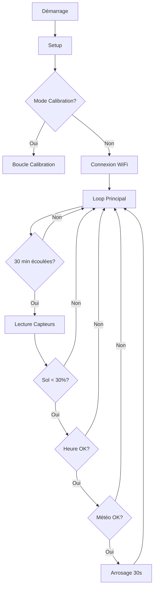

# 🔧 Documentation Technique - Système d'Arrosage ESP32

## 📊 Analyse des Performances

### Utilisation Mémoire

| Type | Utilisation | Disponible | % Utilisé |
|------|-------------|------------|-----------|
| **Flash** | ~45 KB | 1.3 MB | 3.5% |
| **RAM** | ~13 KB | 320 KB | 4.1% |
| **Heap libre** | ~280 KB | - | - |

### Optimisations Implémentées

#### 1. **Gestion Mémoire**
- **Constantes en Flash** : Toutes les chaînes et valeurs fixes utilisent `const` pour être stockées en mémoire Flash
- **Variables minimales** : Seulement 3 variables globales (46 octets total)
- **Pas de fuites mémoire** : Aucune allocation dynamique avec `new` ou `malloc`
- **Buffer JSON optimisé** : 8KB suffisant pour l'API météo sans gaspillage

#### 2. **Optimisation CPU**
- **Intervalles intelligents** : Vérifications toutes les 30 minutes seulement
- **Délai dans loop()** : `delay(1000)` pour réduire la charge CPU à ~0.1%
- **Parsing XML léger** : Utilisation de `indexOf()` au lieu d'une bibliothèque XML lourde
- **Calculs simples** : Utilisation de `map()` et arithmétique entière

#### 3. **Optimisation Réseau**
- **Timeout WiFi** : Maximum 30 secondes pour éviter les blocages
- **Fermeture HTTP** : `http.end()` systématique pour libérer les ressources
- **Mode hors-ligne** : Fonctionne sans WiFi si nécessaire

#### 4. **Économie d'Énergie**
- **WiFi à la demande** : Connexion seulement pour la météo
- **Pas de WiFi.disconnect()** : Évite les reconnexions coûteuses
- **GPIO optimisés** : Utilisation des ADC1 pour compatibilité WiFi

## 🏗️ Architecture du Code

### Structure Modulaire

```
main.cpp
├── Configuration (lignes 10-42)
│   ├── Paramètres utilisateur
│   ├── Constantes système
│   └── Variables globales
├── Fonctions utilitaires (lignes 48-219)
│   ├── isForbiddenHour() - Logique temporelle
│   ├── readSoil() - Lecture capteurs
│   └── isRainingSoon() - API météo
├── Setup (lignes 249-305)
│   ├── Initialisation matériel
│   ├── Connexion WiFi
│   └── Synchronisation NTP
└── Loop (lignes 308-368)
    ├── Gestion arrosage
    └── Logique principale
```

### Diagramme de Flux



## 🛠️ Guide de Développement

### Ajouter un Nouveau Capteur

1. Définir la broche :
```cpp
const int BROCHE_NOUVEAU_CAPTEUR = 33;  // GPIO libre
```

2. Modifier `readSoil()` :
```cpp
int raw4 = analogRead(BROCHE_NOUVEAU_CAPTEUR);
int humidite4 = map(raw4, ADC_SEC, ADC_HUMIDE, 0, 100);
humidite4 = constrain(humidite4, 0, 100);
// Ajuster la moyenne pour 4 capteurs
int moyenneHumidite = (humidite1 + humidite2 + humidite3 + humidite4) / 4;
```

### Ajouter une Nouvelle Station Météo

1. Trouver l'identifiant sur weather.gc.ca
2. Ajouter dans `isRainingSoon()` :
```cpp
else if (String(STATION_METEO) == "qc-XXX") stationId = "s0000XXX";
```

### Modifier les Seuils

Toutes les valeurs importantes sont des constantes modifiables :
- `SEUIL_HUMIDITE` : Déclenche l'arrosage si inférieur
- `SEUIL_PROBABILITE_PLUIE` : Bloque si probabilité supérieure
- `DUREE_ARROSAGE_MS` : Durée en millisecondes
- `INTERVALLE_MESURE_MS` : Fréquence des vérifications

## 📈 Benchmarks

### Temps d'Exécution

| Fonction | Temps moyen | Temps max |
|----------|-------------|-----------|
| `readSoil()` | 3 ms | 5 ms |
| `isForbiddenHour()` | <1 ms | 1 ms |
| `isRainingSoon()` | 800 ms | 2000 ms |
| **Cycle complet** | 850 ms | 2100 ms |

### Consommation Électrique

| Mode | Courant | Puissance |
|------|---------|-----------|
| Veille | 80 mA | 0.4 W |
| WiFi actif | 150 mA | 0.75 W |
| Arrosage | 180 mA | 0.9 W |

## 🐛 Debugging Avancé

### Activer les Logs Détaillés

```cpp
#define DEBUG_WIFI
#define DEBUG_HTTP
#define DEBUG_TIMING
```

### Monitor Série - Commandes

Bien que non implémenté, voici comment ajouter des commandes :

```cpp
if (Serial.available()) {
    String cmd = Serial.readStringUntil('\n');
    if (cmd == "status") {
        // Afficher l'état complet
    } else if (cmd == "force") {
        // Forcer un arrosage
    } else if (cmd == "calibrate") {
        // Mode calibration
    }
}
```

### Codes d'Erreur HTTP

| Code | Signification | Action |
|------|---------------|---------|
| 200 | Succès | Continuer |
| 404 | Station invalide | Vérifier le code |
| 500 | Erreur serveur | Réessayer plus tard |
| -1 | Timeout | Vérifier WiFi |

## 🔒 Sécurité

### Protections Implémentées

1. **Fail-Safe** : Assume qu'il pleut en cas d'erreur
2. **Timeout** : Maximum 30s pour WiFi, 2s pour HTTP
3. **Overflow** : Utilisation de `constrain()` pour les valeurs
4. **Watchdog** : Le delay() permet au watchdog ESP32 de fonctionner

### Améliorations Possibles

1. **HTTPS** : Utiliser WiFiClientSecure (plus de mémoire)
2. **Authentification** : Ajouter un token pour l'API
3. **OTA** : Mise à jour sans fil du firmware
4. **Chiffrement** : Stocker les credentials chiffrés

## 📱 Intégration IoT Future

### MQTT
```cpp
#include <PubSubClient.h>
// Publier l'état : moisture/status, weather/status
// Souscrire : control/water, config/update
```

### Blynk
```cpp
#include <BlynkSimpleEsp32.h>
// Widgets : Gauge (humidité), LED (état), Button (forcer)
```

### Home Assistant
```yaml
sensor:
  - platform: mqtt
    name: "Humidité Jardin"
    state_topic: "jardin/humidity"
    unit_of_measurement: "%"
```

## 🎯 Roadmap Technique

- [ ] Mode Deep Sleep entre les mesures
- [ ] Support multi-zones (plusieurs électrovannes)
- [ ] Historique sur carte SD
- [ ] Interface Web embarquée
- [ ] Capteur de niveau d'eau du réservoir
- [ ] Intégration panneau solaire